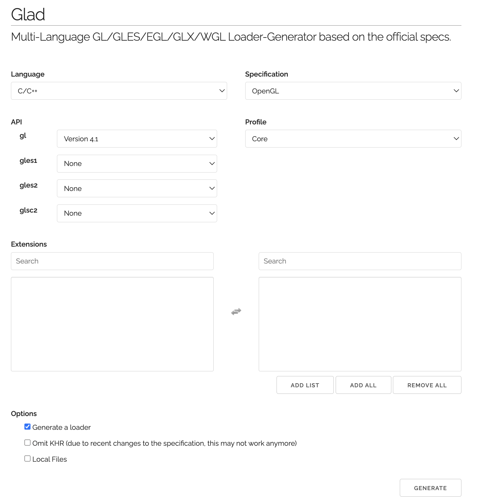
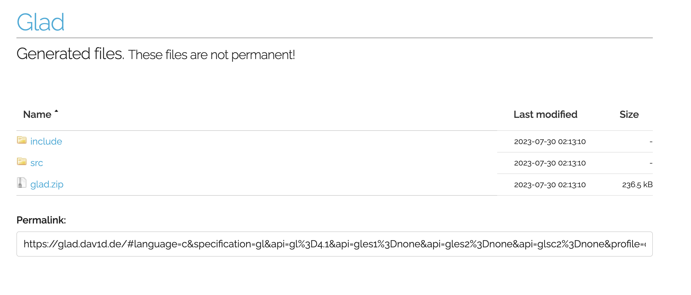
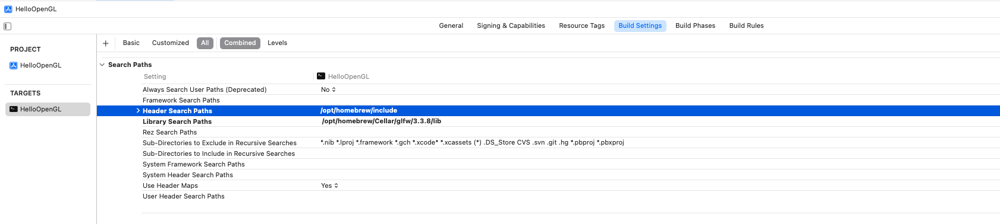
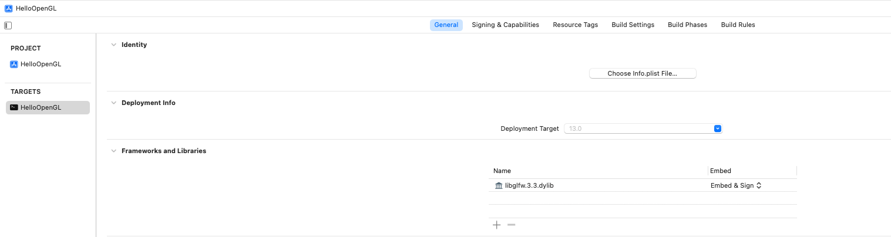
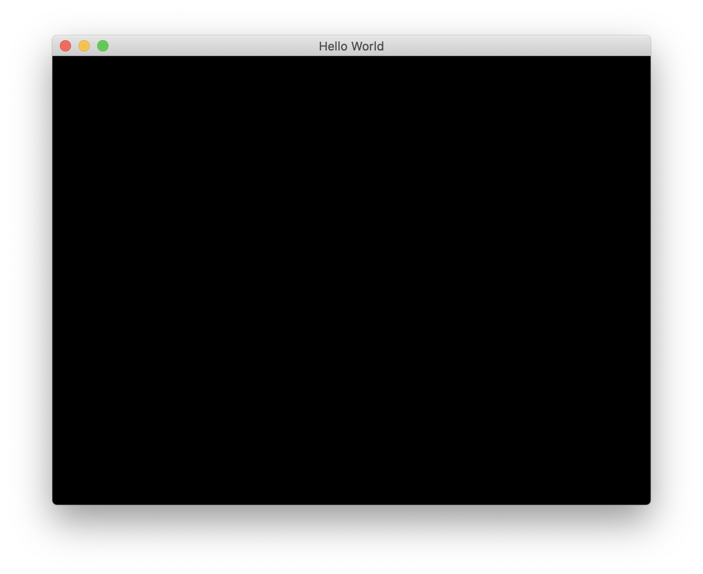

## OpenGL Setup in macOS

Refrence: [blog](https://giovanni.codes/opengl-setup-in-macos/)

### Libraries

- `GLFW`: 提供跨平台的 OpenGL 上下文初始化与窗口创建等功能. [website](https://www.glfw.org/docs/latest/)
- `GLAD`: 提供跨平台的 OpenGL 函数指针加载等功能. [website](https://glad.dav1d.de/)

### Install GLFW

```
brew install glfw
```

Find the installed library include path : `/opt/homebrew/Cellar` `/opt/homebrew/include`

```
brew config | grep HOMEBREW
```

### Download GLAD



Once you are downloaded and unzipped the folder, put the glad and KHR folders in the `/opt/homebrew/include` directory of your mac.

### Create a Xcode Project

- Create a new Project and select macOS, then Command Line Tool, finally click on Next
- Then, put a name to your project(HelloOpenGL) and select C++ as language, next and save the project
- In the zip that you downloaded, you will have a glad.c file, add that file to your project
- We need to configure Xcode to find the libraries that we added, so in your Xcode, select the Project Target and then Build Settings and in Header Search Paths add `/opt/homebrew/include`
  
  Now, in Framework and Libraries you need to add the libglfw library, so clic on + symbol and add the library that you will find in /usr/local/Cellar/glfw/3.3/lib `/opt/homebrew/Cellar/glfw/3.3.8/lib`
  
- Now edit `main.cpp`, run project
  
